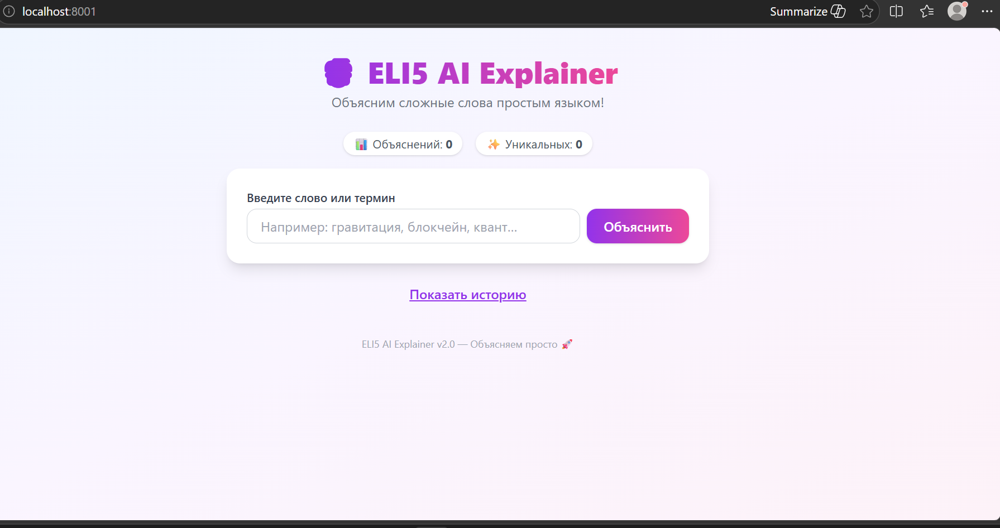
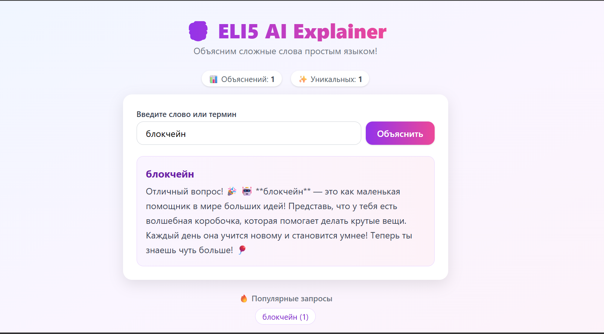

# 🧒 ELI5 AI Explainer

> Explain complex terms in plain simple language — like you're five!

---

## 📸 Demo

### Main Screen


### Explaining a Term


---

## 🎯 Context

### End Users
- **Students** who encounter unfamiliar technical terms and want to quickly understand them
- **Parents** explaining complex concepts to their children
- **Anyone** who prefers a clear, jargon-free explanation over a dense Wikipedia article

### Problem
When people look up technical terms, they usually get dry, academic definitions that are hard to grasp. ELI5 AI Explainer gives explanations in **plain, friendly language** — as if you were explaining to a five-year-old (Explain Like I'm 5).

### Our Solution
A web app where you type a term and instantly receive a friendly, emoji-enhanced explanation. All requests are saved to a searchable history with the ability to delete individual entries or clear everything.

---

## ✨ Features

### ✅ Implemented (Version 2)
| Feature | Description |
|---------|-------------|
| 🧠 Term explanation | 70+ predefined terms + fallback generation for new words |
| 📜 Request history | All explanations are persisted in the database |
| 🔍 History search | Instant search by term or content |
| 🗑️ Delete entries | Remove a single entry or clear all history |
| 📊 Statistics | Total explanations and unique terms counter |
| 🔥 Popular terms | Most frequently requested terms as clickable chips |
| ❤️ Health check | `/health` endpoint for Docker monitoring |

### 🚧 Planned
- [ ] Term categories with color-coded tags
- [ ] Export history to PDF
- [ ] Dark theme
- [ ] Multi-language support (EN/RU)

---

## 🚀 Usage

### Quick Start (local)
```bash
# 1. Install dependencies
pip install -r requirements.txt

# 2. Start the server
python -m uvicorn main:app --reload

# 3. Open in browser
http://localhost:8000
```

### API Endpoints
| Method | Path | Description |
|--------|------|-------------|
| `GET` | `/` | Web interface (SPA) |
| `POST` | `/api/explain` | Explain a term |
| `GET` | `/api/history` | Get full history |
| `GET` | `/api/search?q=...` | Search history |
| `DELETE` | `/api/history/{id}` | Delete one entry |
| `DELETE` | `/api/history` | Clear all history |
| `GET` | `/api/stats` | Usage statistics |
| `GET` | `/api/popular` | Most popular terms |
| `GET` | `/health` | Health check |

---

## 🐳 Deployment

### VM Requirements
- **OS:** Ubuntu 24.04 (or any Linux with Docker support)
- **Docker** and **Docker Compose** must be installed

### Step 1: Install Docker on Ubuntu 24.04
```bash
# Update packages
sudo apt update && sudo apt upgrade -y

# Install Docker
curl -fsSL https://get.docker.com | sudo sh

# Add user to docker group
sudo usermod -aG docker $USER
```

### Step 2: Deploy the Application
```bash
# Clone the repository
git clone https://github.com/<your-username>/se-toolkit-hackathon.git
cd se-toolkit-hakathon

# (Optional) Change port if 8000 is already in use
# Edit .env file and set HOST_PORT to a different port (e.g., 8080)
# HOST_PORT=8080

# Start with Docker Compose
docker compose up -d --build

# Check logs
docker compose logs -f
```

### Step 3: Access the Application
The app will be available at:
```
http://<your-server-ip>:8000
```

Or if you changed the port in `.env`:
```
http://<your-server-ip>:<your-port>
```

### Troubleshooting

#### Port Already in Use
If you get an error that port 8000 is already in use:

**Option 1: Change the port in `.env` file**
```bash
# Edit .env file
nano .env

# Change HOST_PORT to a different port
HOST_PORT=8080

# Restart the container
docker compose down
docker compose up -d
```

**Option 2: Find and stop the process using port 8000**
```bash
# Find what's using port 8000
sudo lsof -i :8000

# Stop the process (replace <PID> with the actual process ID)
sudo kill -9 <PID>

# Restart your container
docker compose restart
```

#### Permission Issues with Database
If you get permission errors with the SQLite database:
```bash
# Rebuild the container with the --force-recreate flag
docker compose down
docker compose up -d --build --force-recreate
```

### Stop
```bash
docker compose down
```

### Run without Docker
```bash
pip install -r requirements.txt
python -m uvicorn main:app --host 0.0.0.0 --port 8000
```

---

## 🏗️ Architecture

```
┌─────────────┐       ┌──────────────┐       ┌──────────────┐
│   Frontend  │ ◄──►  │   Backend    │ ◄──►  │   Database   │
│  (HTML/JS)  │  HTTP │  (FastAPI)   │  SQL  │   (SQLite)   │
└─────────────┘       └──────────────┘       └──────────────┘
```

- **Backend:** Python 3.12, FastAPI, Uvicorn
- **Database:** SQLite (persisted via Docker volume)
- **Frontend:** Vanilla JS + TailwindCSS (Single Page Application)

---

## 📄 License

This project is licensed under the **MIT License**. See the [LICENSE](LICENSE) file for details.
